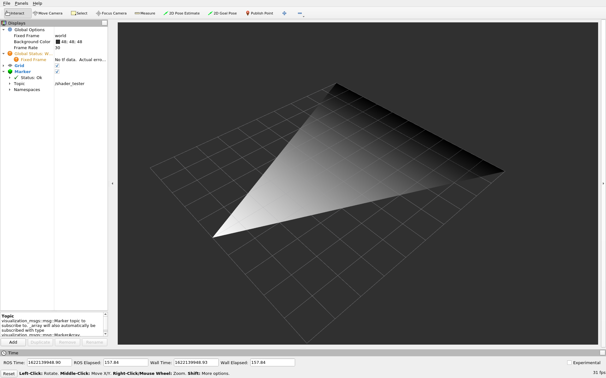

# rviz_shader_tester
Creates a triangle marker with a gradient.

The goal is to make the gradient pull from a texture map instead of the default grayscale. This 
will enable complex coloring of markers.

